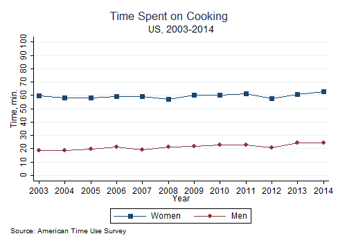

# Building Trend Lines Plots


```{r, echo=FALSE, message=FALSE}
require(knitr)
statapath <- "C:/Program Files (x86)/Stata12/StataSE-64.exe"
opts_chunk$set(engine="stata", engine.path=statapath, comment="")
```

The data here is derived from the [American Time Use Survey](http://www.bls.gov/tus/). For the coding procedures, contact me via email.

## Step 1. Downloading the dataset
You need to download the ATUS_full3.dta file from my github to your working directory.

```{r, results='hide'}
use ATUS_full3.dta, clear
```


## Step 2. Create New Variables with Means by Groups

Here's how you can create means by groups and by year (for example for married men and women for the variable DVCOOK)

```{r, results='hide'}
egen mn_DVCOOKF = mean(DVCOOK) if Female==1 & Married==1, by(Year)
egen mn_DVCOOKM = mean(DVCOOK) if Female==0 & Married==1, by(Year)
```

## Step 3. Build Connected Trend Lines

Using the created variables, now we can build a graph of trends by year.

```{r, echo=2:15}
use ATUS_full3.dta, clear
tw (connected mn_DVCOOKF Year, ms(S))(connected mn_DVCOOKM Year), ///
	graphregion(color(white)) ///
	bgcolor(white) ///
	ytitle("Time, min.") ///
	title("Time Spent on Cooking", span) ///
	subtitle("US, 2003-2014") ///
	note("Source: American Time Use Survey", span) ///
	legend(label(1 "Women") label(2 "Men")) ///
	xlabel(2003[1]2014) ///
	yscale(range(0 100)) ///
	ylabel(0[10]100) ///
	name(cook, replace)
graph export 003.png, as(png) replace 
```
  