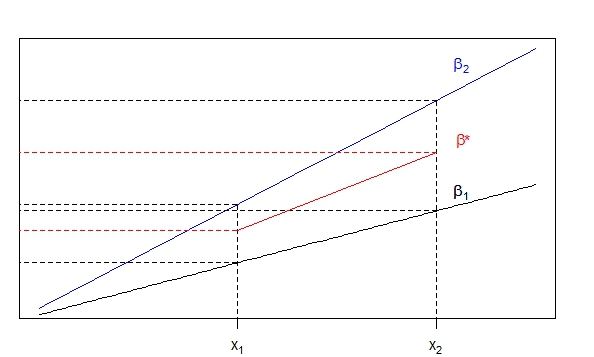

# Oaxaca-Blinder
Kamila Kolpashnikova  
May 11, 2016  

# Oaxaca-Blinder Decomposition in Stata with Survey Weights


The data here is derived from the [American Time Use Survey](http://www.bls.gov/tus/). For the coding procedures, contact me via email.

## Step 1. Downloading the dataset
You need to download the ATUS_full3.dta file from my github to your working directory.


```stata
use ATUS_full3.dta, clear
```

What is the Oaxaca-Blinder decomposition method? The Blinder-Oaxaca pooled method includes the differentiation between the explained part of the gap and the unexplained part of the gap. The definitions for explained and unexplained decomposition can be represented in the following way:

$R = [E(X_1) - E(X_2)] '\beta^* + [E(X_1) ' (\beta_1 - \beta^*) + E(X_2) ' (\beta^* -\beta_2)]$, where


$[E(X_1) - E(X_2)] '\beta^*$ is the explained part and 
$[E(X_1) ' (\beta_1 - \beta^*) + E(X_2) ' (\beta^* -\beta_2)]$ is unexplained.

Where $\beta^*$ is non-discriminatory coefficients vector (Oaxaca and Ransom 1994; Jann 2008). 

For a variation of the pooled decomposition:
$\beta^* = W\beta_A + (I-W)\beta_B$; where $W$ – relative weights given to coefficients of group A (Oaxaca and Ransom 1994). $\hat{W}=\Omega=(X_A’X_A+X_B’X_B)^{-1}X_A’X_A$. In this tutorial, I used the pooled method of constructing the non-discriminatory wage structures as proposed by Oaxaca and Ransom (1994). The Fig . below represents such a situation where $W=0.5$.
  For more detail, please see Elder, Goddeeris, and Haider (2010).

 

To see how much of the gender gap the difference in the men’s and women’s mean on a particular variable produces in an outcome variable, we multiply the mean difference by the slope from the hypothesized non-discriminatory slope $ß^*$, since the slope tells us the rate of return to a unit change in the variable (see Fig.). This produces the amount of the dependent variable which we can explain with the difference in the independent variable. The unexplained part therefore, is the difference from the explained part to the highest point in the interval of the slope above and the difference to the lowest point in the interval from the slope below. This part is usually attributed to the effects of discrimination and unobserved variables (Jann 2008).

There are a few variations of the (two-fold) Oaxaca-Blinder decomposition:

*  To use Group 1 coefficients as reference, you need the Stata command `weight(1)`.

* To use Group 2 coefficients as reference, you need the Stata command `weight(0)`.

* If you need the coefficients from a pooled regression as reference as specified above (Neumark 1988) and excluding the group indicator, use the Stata command `omega`.

* If you need the coefficients from a pooled regression as reference as specified above (Jann 2008) and including the group indicator, use the Stata command `pooled`.


## Step 2. Running the Oaxaca-Blinder Decomposition in Stata

You can use a variation of the following command to run a `pooled` two-fold Oaxaca-decomposition:


```stata
#delim ;
oaxaca lnDVCOOK IncomeTransfer Weekday Year
[pw=Weight] if Married==1 
& HhldSize>1 & BornInUSA==1, by(Female) pooled robust;
```

```
Blinder-Oaxaca decomposition                      Number of obs   =      39595
                                                  Model           =     linear
Group 1: Female = 0                               N of obs 1      =      13651
Group 2: Female = 1                               N of obs 2      =      25944

--------------------------------------------------------------------------------
      lnDVCOOK |      Coef.   Std. Err.      z    P>|z|     [95% Conf. Interval]
---------------+----------------------------------------------------------------
overall        |
       group_1 |   3.396838   .0111317   305.15   0.000      3.37502    3.418656
       group_2 |   3.874199   .0075316   514.39   0.000     3.859438    3.888961
    difference |  -.4773614   .0134402   -35.52   0.000    -.5037037   -.4510191
     explained |  -.0646089    .003788   -17.06   0.000    -.0720333   -.0571844
   unexplained |  -.4127525   .0137204   -30.08   0.000     -.439644   -.3858611
---------------+----------------------------------------------------------------
explained      |
IncomeTransfer |  -.0670399   .0036881   -18.18   0.000    -.0742684   -.0598115
       Weekday |   .0016783   .0007919     2.12   0.034     .0001262    .0032305
          Year |   .0007527   .0003751     2.01   0.045     .0000176    .0014879
---------------+----------------------------------------------------------------
unexplained    |
IncomeTransfer |  -.0288756   .0050905    -5.67   0.000    -.0388528   -.0188985
       Weekday |  -.1026541   .0180548    -5.69   0.000    -.1380407   -.0672674
          Year |   22.53606   7.198423     3.13   0.002     8.427406    36.64471
         _cons |  -22.81728   7.197366    -3.17   0.002    -36.92386   -8.710701
--------------------------------------------------------------------------------
```

You can also use `detail` specification to see the effect of the combined variables.


```stata
#delim ;
oaxaca lnDVCOOK lnDVPAID Children HhldSize Under5
FullTime PartTime Other Weekday Year[pw=Weight] if Married==1 
& HhldSize>1 & BornInUSA==1, by(Female) pooled robust relax
detail(Emp: FullTime PartTime Other);
```

```
Blinder-Oaxaca decomposition                      Number of obs   =      16041
                                                  Model           =     linear
Group 1: Female = 0                               N of obs 1      =       6727
Group 2: Female = 1                               N of obs 2      =       9314

------------------------------------------------------------------------------
    lnDVCOOK |      Coef.   Std. Err.      z    P>|z|     [95% Conf. Interval]
-------------+----------------------------------------------------------------
overall      |
     group_1 |   3.178306   .0149955   211.95   0.000     3.148915    3.207696
     group_2 |   3.607364   .0113488   317.86   0.000     3.585121    3.629608
  difference |  -.4290586   .0188058   -22.82   0.000    -.4659173   -.3921998
   explained |  -.0310219    .005491    -5.65   0.000    -.0417841   -.0202598
 unexplained |  -.3980366   .0191087   -20.83   0.000    -.4354891   -.3605842
-------------+----------------------------------------------------------------
explained    |
    lnDVPAID |   -.020901   .0030364    -6.88   0.000    -.0268522   -.0149498
    Children |   .0052965   .0019284     2.75   0.006     .0015169    .0090761
    HhldSize |   .0029706   .0015543     1.91   0.056    -.0000757    .0060169
      Under5 |  -.0013118   .0013757    -0.95   0.340    -.0040082    .0013846
         Emp |  -.0188331   .0042856    -4.39   0.000    -.0272327   -.0104335
     Weekday |   .0006296   .0005001     1.26   0.208    -.0003506    .0016098
        Year |   .0011273   .0006287     1.79   0.073     -.000105    .0023595
-------------+----------------------------------------------------------------
unexplained  |
    lnDVPAID |  -.0109932   .1405219    -0.08   0.938    -.2864109    .2644246
    Children |   .0283648    .030039     0.94   0.345    -.0305105    .0872402
    HhldSize |  -.1394688   .0712782    -1.96   0.050    -.2791716    .0002339
      Under5 |   .0127992    .009905     1.29   0.196    -.0066142    .0322126
         Emp |   .0507413   .0529143     0.96   0.338    -.0529688    .1544514
     Weekday |   -.108484   .0446155    -2.43   0.015    -.1959288   -.0210392
        Year |   27.72879   10.29912     2.69   0.007     7.542895    47.91469
       _cons |  -27.95979   10.29938    -2.71   0.007    -48.14619   -7.773381
------------------------------------------------------------------------------
Emp: FullTime PartTime Other

```

