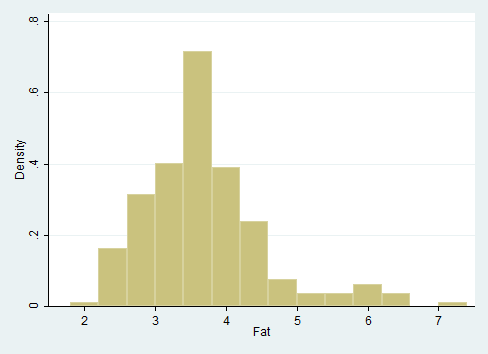
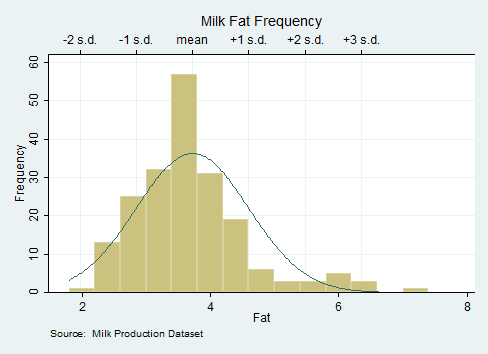

```{r, echo=FALSE, message=FALSE}
require(knitr)
statapath <- "C:/Program Files (x86)/Stata12/StataSE-64.exe"
opts_chunk$set(engine="stata", engine.path=statapath, comment="")
```


First, let's load some data from the web. There are many available datasets but you can use your own as well.

# Step 1. Create a directory for your project:

```{r, results='hide'}
mkdir c:\chp
cd c:\chp
```


# Step 2. Loading datasets
Now let's load the datasets. There are many free datasets out there, you just need to make sure that they are in stata-readable format.

```{r, results='hide'}
net from http://www.ats.ucla.edu/stat/stata/examples/
net get chp
```

I chose some that I could find online. You can find the description of the datasets <a href="http://www.ats.ucla.edu/stat/stata/examples/chp/chpstata_dl.htm">here</a>.

Let's use the first file in the list: Milk production, p004.dta

```{r, results='hide'}
use p004.dta, clear
```

# Step 3. Making a histogram

Making histograms in Stata is very easy:

```{r, echo=2,results='hide'}
use p004.dta, clear
hist fat
graph export 001.png, as(png)
```
  

Let's now add ticks for the mean and standard deviation, using the `summarize` command.

```{r, echo=2}
use p004.dta, clear
summarize fat
```

Now let's add some more information to our histogram. 

```{r, echo=2:14,results='hide'}
use p004.dta, clear
histogram fat, freq normal ///
         xaxis(1 2) ///
         ylabel(0(10)60, grid) ///
         xlabel(3.723116 "mean" ///
              2.8482317 "-1 s.d." ///
              4.5980003 "+1 s.d." ///
               1.9733474 "-2 s.d." ///
              5.4728846 "+2 s.d." ///
              6.3477689 "+3 s.d." ///
                                 , axis(2) grid gmax) ///
         xtitle("", axis(2)) ///
         subtitle("Milk Fat Frequency") ///
         note("Source:  Milk Production Dataset")
graph export 002.png, as(png)
```
  
